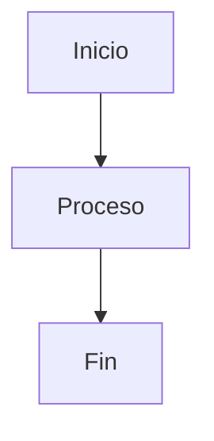
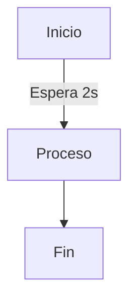
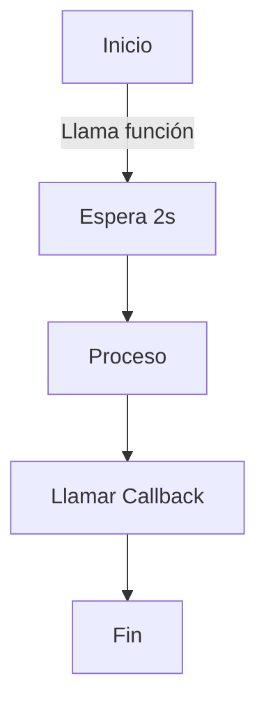
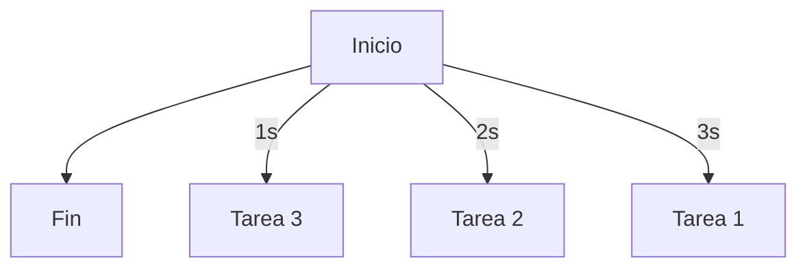

# Diagramas de Flujo de Sincronía y Asincronía en Node.js

## 1. Sincronía
En la ejecución síncrona, cada instrucción se ejecuta en orden y bloquea la siguiente hasta que termine.

## 2. Asincronía Secuencial
Usando `async/await`, el código espera el resultado de una operación antes de continuar, pero sin bloquear completamente el hilo.

## 3. Asincronía con Callback
Se ejecuta una función, y cuando termina su tarea, llama a otra función pasada como argumento.

## 4. Asincronía Paralela
Múltiples tareas se ejecutan al mismo tiempo sin depender unas de otras.

